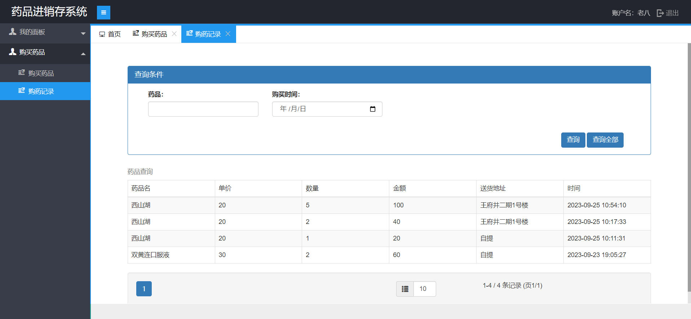

# 基于SpringBoot的药品进销存管理系统 

（源代码+12000字文档+ppt）

## 项目简介

基于SpringBoot的药品进销存管理系统，分为管理员、员工、客户三个角色。 
员工可以在系统中对药品、客户、经销商进行管理，并且可以实现药品从进货到入库盘库，以及销售、退货等一系列进销存管理。 
管理员在员工拥有的功能基础上可以对员工进行管理。 
客户可以在系统中购买药品并且可以查询自己的购买记录。 
本系统后端使用springboot框架。数据库使用的是mysql数据库。 
该系统功能完善，界面美观，非常适合作为毕设或者课程作业以及新手开发学习。 

## 功能介绍
 

## 技术服务

## 系统图片
#### 1.登录页面
 
#### 2.系统首页
 
#### 3.员工管理
 
#### 4.药品管理
 
#### 5.客户管理
 
#### 6.经销商管理
 
#### 7.进货管理
 
#### 8.退货管理
 
#### 9.销售账单查询
 
#### 10.客户-购买药品
 
#### 11.客户-购买记录查询
 
